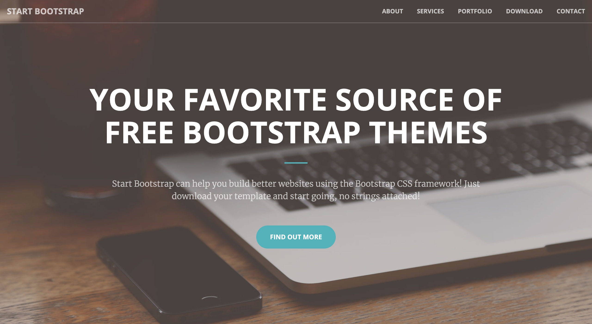

# Liminal Jekyll Theme [](https://travis-ci.org/kelley12/liminal-jekyll-theme/) [](https://github.com/Kelley12/liminal-jekyll-theme/blob/master/LICENSE)

A Jekyll implementation of the Creative Theme template by Start Bootstrap.



## Installation

Add this line to your Jekyll site's `Gemfile`:

```ruby
gem "liminal-jekyll-theme"
```

And add this line to your Jekyll site's `_config.yml`:

```yaml
theme: liminal-jekyll-theme
```

If you are using this theme for GitHub pages, also ass this line to `_config.yml`:

```yaml
remote-theme: kelley12/liminal-jekyll-theme
```

And then execute:

```bash
bundle
```

Or install it yourself as:

```bash
gem install liminal-jekyll-theme
```

## Usage

### Layouts

#### Default

The default theme is what is used for the main page

### Includes

The includes directory contains 3 folders: head, body, and sections

#### Head

The head directory contains

#### Body

The body directory contains

#### Sections

The sections directory contains

### Assets

Used to store images for the background images and the portfolio section if used

## Contributing

Bug reports and pull requests are welcome on GitHub at https://github.com/Kelley12/liminal-jekyll-theme. This project is intended to be a safe, welcoming space for collaboration, and contributors are expected to adhere to the [Contributor Covenant](http://contributor-covenant.org) code of conduct.

## Development

To set up your environment to develop this theme, run `bundle install`.

The theme is setup just like a normal Jekyll site. To test the theme, run `bundle exec jekyll serve` and open your browser at `http://localhost:4000`. This starts a Jekyll server using the theme. Add pages, documents, data, etc. like normal to test the theme's contents. As you make modifications to the theme and to the content, the site will regenerate and you should see the changes in the browser after a refresh, just like normal.

## License

The theme is available as open source under the terms of the [MIT License](https://opensource.org/licenses/MIT).
